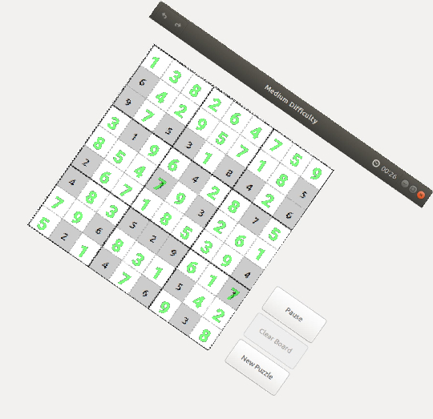

# SUDOKU MASTER

## Description

### Introduction 

This project is a sudoku solver on images(OCR (Optical Character Recognition)).

### Features

The program can do several things : 

* Train the neural network with Mnist dataset and a handmade dataset
* Solve a sudoku grid from an image
* Recognize errors in the grid of a "resolved" sudoku
* Get back the digits from the grid to train the neural network afterwards



## How to use

### Installation

To install the project, you need to clone the repository and then compile it(see the Compilation section).

```git clone git@github.com:Aur3lienH/SudokuSolver.git ```

#### Compilation

<span style="color:red">Prerequisites : make, gcc, gdk, sdl2, sld2-image, gtk3</span>


To compile the project, run the following command in the root directory of the project:

```cd SudokuSolver```

```cmake -S . -B build```

```cmake --build build```

### Execution

To enable the execution of the program, you need to give the execution rights to the executable. 

```chmod +x build/Solver```

The executable is located in the build/ directory and is named solver. So to run it, in the root directory : 

```./build/solver --ui```

## Usage

### Basic usage 

Get all the usage of the program :

```./build/solver --help```

Train the network with the Mnist dataset :
    
```./build/solver -t```

Run the tests :

```./build/solver --tests```


The program has several flags for differents use and for testing and debugging purposes. Here is the list of all the flags : 

* --train or -t : train the neural network with the Mnist dataset (1 training dataset and 1 testing dataset)

* --tests : run the tests

* --ui : run the program with the user interface

